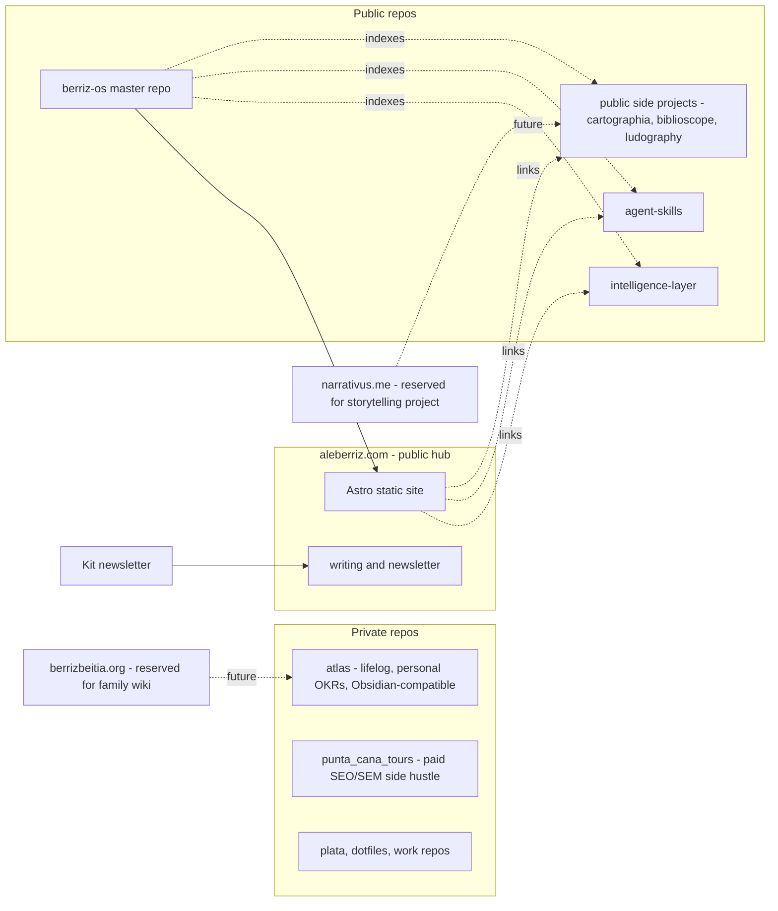

<!-- Generated from Cursor plan session. Last updated: 2026-04-17. Update this file as phases complete. -->

## Phase status tracker

| Phase | Status | Notes |
|-------|--------|-------|
| 0 — Narrative canon | **done** | brand/narrative.md, brand/voice.md, brand/foss-posture.md |
| 1 — berriz-os scaffold | **done** | This repo. AGENTS.md, llms.txt, projects.yaml, .cursor/rules/, roadmap/, collaborations/, workspaces/ |
| 2 — aleberriz.com website | pending | |
| 3 — GitHub + LinkedIn alignment | pending | |
| 4 — atlas private lifelog | pending | |
| 5 — agent-skills growth | pending | communication-*, process-okr, fill Planned skills |
| 6 — FOSS posture documented | **done** | brand/foss-posture.md |
| 7 — Kit newsletter | pending | |
| 8 — Public side projects | pending | cartographia, biblioscope, ludography |
| 9 — First OSS contribution | pending | Target: agentskills/agentskills |
| 10 — Quarterly cadence | pending | |

---

# Personal Brand System — Multi-Phase Plan

## Guiding thesis

Position: **"Narratives in numbers."** A senior data analyst who treats the semantic layer as the narrative layer — where business operators, human analysts, and AI agents all draw from the same source of truth. Differentiators to keep visible (so you don't read as "just another technical profile"):

- MBA + 18 years across Data/Ops/Finance/Sales (not a pure IC)
- OKR Master — operating-system thinking for teams
- Trilingual (EN/ES/FR), Paris-based
- Storyteller — communication is the craft, not a footnote. Shown through writing and voice rather than claimed.
- FOSS-leaning, anti-lock-in (Fedora/Ubuntu/Mint + VSCodium)
- AWS AI Practitioner — kept as a single line, **not** a headline

The stack you already have ([README.md](/home/creator/repos/intelligence-layer/README.md) for `intelligence-layer`, [README.md](/home/creator/repos/agent-skills/README.md) for `agent-skills`) is the strongest version of this thesis. Everything downstream points at those two repos.

## Target topology



---

## Phase 0 — Narrative canon (Week 1, pre-work for everything else)

One file in `berriz-os/brand/narrative.md` that every other asset quotes from:

- One-line tagline: *"Semantic layers for human and machine analysts — told in narratives, grounded in numbers."*
- Three-line bio (short/medium/long variants) reused on GitHub, LinkedIn, website, newsletter.
- Five proof points (intelligence-layer, agent-skills, Kit role, OSI involvement, MBA+OKR).
- Voice guide: economist-precise prose, occasional wit, no hype, no emojis in long-form.

This is the single source the website, both profiles, and the newsletter all pull from.

## Phase 1 — `aleberriz/berriz-os` master repo (Week 1)

**Public.** This is your *public operating system* — the surface where visitors (and agents) land to understand what you build and why. Anything personal-strategic (OKRs, career planning, reflection) lives in `atlas` (private) instead; `berriz-os` contains only what's meant to be read.

Structure:

- `README.md` — high-level map of all your public work, links out
- `AGENTS.md` — AI agent entry point (see below)
- `llms.txt` — machine-readable navigation index, mirroring [agentskills.io/llms.txt](https://agentskills.io/llms.txt) convention
- `brand/` — `narrative.md`, `bios.md`, `voice.md`, `foss-posture.md`, visual-identity assets
- `roadmap/` — this plan copied in as `2026-personal-brand.md`; future quarterly plans
- `projects/index.md` + `projects/projects.yaml` — annotated table of every public repo with status (active/archived/idea); the YAML is the machine-readable source, the markdown is rendered from it
- `collaborations/` — one `.md` per OSS target with goal, first contribution idea, status (see Phase 9)
- `website/` — the Astro site (Phase 2)
- `workspaces/` — `.code-workspace` files for occasional multi-root Cursor sessions

### AI-interpretability requirements

The repo must be self-describing so that a Cursor/Claude/Codex agent opening it as a fresh workspace can immediately answer: *what is this, what does each folder do, where do I start, what are the conventions?* This is table stakes for your "continued evolution" requirement.

- **`AGENTS.md`** at root, short (≤100 lines), with: one-paragraph mission, folder map, conventions link (points to `agent-skills/process-git`), "where to start" checklist for common agent tasks (*update projects index*, *draft a new OKR*, *add a collaboration target*, *publish a new essay*).
- **`llms.txt`** — flat list of canonical pages and their purpose. Fetched by agents that support the `llms.txt` convention.
- **`projects/projects.yaml`** — structured source of truth. Schema: `slug`, `repo_url`, `visibility`, `status`, `one_liner`, `tags`, `last_reviewed`. `projects/index.md` is a rendered view you regenerate via a small script or agent command.
- **`.cursor/rules/`** — repo-scoped rules: "always update `projects.yaml`, not the rendered md"; "new collaborations get a one-pager in `collaborations/`"; "OKRs do NOT live here — they live in `atlas`".
- **Stable naming conventions** for time-series content: `YYYY-QN-<slug>.md` for quarterly docs, `YYYY-MM-DD-<slug>.md` for newsletter issues.

Use conventional commits and the `process-git` skill you already wrote.

## Phase 2 — `aleberriz.com` website (Weeks 2-3)

Since you're deferring to my criteria: decisions below are committed, not a menu.

**Stack**: [Astro](https://astro.build) (static-site framework, content-first, batteries-included) + MDX (markdown with optional React components) + Tailwind CSS (utility classes, easy to tweak without design expertise) + the [Astrowind](https://astrowind.vercel.app/) or [Astro Paper](https://astro-paper.pages.dev/) starter as a base to shortcut initial design. Output is plain HTML/CSS/JS, deployable anywhere.

**Hosting**: Cloudflare Pages. Free, already in your Cloudflare account, zero vendor lock-in (the static output moves to any host in minutes).

**Visual identity** (given your blue + silver preference):

- **Primary**: deep midnight blue `#0B1E3F` (ink, links in dark mode, accents)
- **Accent**: slate silver `#B8C4D1` (rules, subtle borders, metadata)
- **Background**: near-white `#F7F8FA` (light) / near-black `#0A0D12` (dark mode)
- **Ink**: `#111418` on light, `#E9ECF1` on dark
- **Typography**: [Fraunces](https://fonts.google.com/specimen/Fraunces) (serif, a bit editorial, sets "The Economist"-adjacent tone) for headings; [Inter](https://fonts.google.com/specimen/Inter) (geometric sans) for body. Both free via Google Fonts, self-hostable for privacy.
- **Favicon / OG image**: monogram "AB" in the midnight-blue + silver palette, generated once from a text-to-SVG tool.

**Style verdict on ossama.is**: good fit. His works *because* the copy is confident and the typography does the heavy lifting. Match the minimalism, lean into your voice, skip any decorative clutter.

Page structure (four pages):

- **/** — hero (~80 words, your voice), then three sections: *Building*, *Writing*, *Reading*.
- **/building** — cards for public projects only: `intelligence-layer`, `agent-skills`, plus the new public side projects (`cartographia`, `biblioscope`, `ludography`) as they ship. Each = one sentence + link. **No** `punta_cana_tours` (paid private hustle — kept off the personal hub to keep the brand clean).
- **/writing** — chronological list of newsletter issues (pulled from Kit RSS) + long-form essays in MDX.
- **/about** — short bio pulled from `brand/narrative.md`, three facts (MBA, OKR Master, trilingual), links to GitHub + LinkedIn + newsletter. Single AWS cert line at the bottom.

Deploy: `aleberriz.com` apex + `www.aleberriz.com` 301 → apex, TLS auto-managed by Cloudflare. `narrativus.me` and `berrizbeitia.org` stay **parked for now** — reserved for the future storytelling project and the future (password-protected) family wiki respectively.

## Phase 3 — GitHub profile + LinkedIn alignment (Week 3)

**GitHub `aleberriz/aleberriz` README rewrite** — current draft over-indexes on AWS. Replace with:

- Headline: *Senior Data Analyst — semantic layers, narratives, and AI-native analytics.*
- What I'm building now: `intelligence-layer`, `agent-skills`, `berriz-os` (linked and described in one line each)
- What I bring besides code: MBA, OKR Master, trilingual (EN/ES/FR), Paris-based, FOSS-leaning
- Tech stack: as-is but reorder so SQL/Python/dbt/Omni lead, AWS/Bedrock trails
- Certifications: one collapsed line, AWS AI Practitioner mentioned as a fact, not a trophy

**Pinned repos** (6 slots): `intelligence-layer`, `agent-skills`, `berriz-os`, `compare-gen-ai-outputs`, `growth-insights-machine`, and one new public side project from Phase 8 (`cartographia` or `biblioscope`, whichever ships first). Unpin: `automate_blockchain_info`, `2023-Dash-Plotly-course`.

**LinkedIn makeover**:

- Headline synced with GitHub: *Senior Data Analyst at Kit — semantic layers, narratives, AI-native analytics.*
- About section: 3 short paragraphs pulled from `narrative.md` (Phase 0).
- Featured: link to `aleberriz.com`, `intelligence-layer`, `agent-skills`, a newsletter issue.
- Skills: prune to the ones you actually want recruiter signal on.
- Services: enabled (selective consulting) — keeps the door open for side-hustle work.

## Phase 4 — `aleberriz/atlas` private lifelog + personal management (Weeks 3-4)

Private repo. Serves two complementary purposes: the **lifelog** (family memories, travel, stories) and the **private mind** (personal OKRs, career planning, reflection) — both live in the same private store so nothing sensitive ever leaks into the public `berriz-os`.

Obsidian- and Logseq-compatible markdown:

```
atlas/
  README.md            # self + family onboarding
  daily/2026/04/2026-04-17.md
  places/<country>/<city>.md
  people/<family-member>.md
  stories/<slug>.md
  timelines/
    family-travel-map.md
  management/          # the private mind
    okrs/2026-Q2.md
    reflections/2026-04-weekly.md
    career/            # negotiation notes, role decisions, long-term moves
  templates/
    daily.md
    story.md
    okr.md
    reflection.md
```

- Each `daily/*.md` has frontmatter with `date`, `location`, `people`, tags. Front-linked via `[[wikilinks]]` so Obsidian graph view works.
- Locations follow a `geo: lat,lon` frontmatter field — future-proof for a cartography renderer.
- Share model: private repo on GitHub. Family members (non-technical) are added via Obsidian Sync or a small web reader later; technical collaborators get direct repo access.
- When the family-wiki project matures, `berrizbeitia.org` becomes the reading surface, **password-protected** (HTTP basic auth at the Cloudflare Pages edge or a simple Cloudflare Access policy), generated from a sanitized subset of `atlas/stories`, `places`, `people`, `timelines` — never `management/`.

## Phase 5 — `agent-skills` growth plan (Weeks 4-6, then ongoing)

Your `plugins/core-skills/skills/` taxonomy (`process-*`, `tooling-*`, `analytics-*`) is already well-aligned with agentskills.io. Extend rather than restructure:

**Add a fourth category, `communication-*`**, to capture the Economist courses and your natural edge:

- `communication-data-storytelling` — from [Data Storytelling course](https://education.economist.com/courses/datastorytelling). Frames: chart-choice decision tree, deception audit, narrative-before-visuals. Invokable when the user asks for any chart, dashboard, or writeup.
- `communication-business-writing` — from [Business Writing course](https://education.economist.com/courses/professionalcommunication). Frames: the Economist style applied to PRs, RFCs, memos; BLUF structure; pruning adverbs. Invokable on any long-form writing task.
- `communication-voice-berriz` — your voice guide (Phase 0) as a skill, so AI-authored content on your behalf doesn't drift.

**Add a new `process-okr` skill** — codifies the OKR cadence (annual, quarterly, weekly check-ins) and the "Betterworks-style" objective/KR writing rules. Used when you ask an agent to help draft OKRs for yourself or clients.

**Fill in the `Planned` rows** in the catalog table by end of Q3 2026:

- `tooling-python` — Poetry, Jupyter, plotnine, pandas patterns you already use.
- `tooling-sql` — Redshift/DuckDB patterns from Kit work (sanitized).
- `analytics-descriptive`, `analytics-experimentation`, `analytics-ml`, `analytics-semantic-layer` — these map 1:1 to your `intelligence-layer` pillars, so write them as *skills that reference* the `intelligence-layer` knowledge base. The skill is the "when to apply"; the knowledge base is the "how it works".

**Governance so it lasts years**:

- Semantic versioning in each `SKILL.md` frontmatter (`version: 0.2.0`).
- `CHANGELOG.md` at the plugin level.
- A lightweight `agent-skills/skill-template/` based on anthropics/skills template, used for every new skill.
- Quarterly review issue on GitHub: "which skills fired, which drifted, which to deprecate."

## Phase 6 — FOSS / hosting posture (ongoing, decisions made in Week 2)

- **Static hosting (website, docs)**: Cloudflare Pages. Free, static output, no lock-in.
- **VPS**: **Hetzner Cloud** (confirmed). Germany, EU data residency, €4-5/mo CX22 tier is enough for Nextcloud + a couple of small services. When you need it: Nextcloud, potential self-hosted Logseq sync, future Mastodon-ish presence.
- **On "Akamai"**: Linode is now Akamai Connected Cloud — fine, FOSS-friendly, but pricier than Hetzner with no meaningful advantage for your use cases. Skip.
- **AWS/GCP**: allowed for specific services (Bedrock for AI experiments, S3 for occasional object storage). Document the posture in `berriz-os/brand/foss-posture.md` so you can quote it consistently.
- **Productivity**: Nextcloud (on Hetzner) + LibreOffice + Obsidian (closed but local-first and MD-based, so still lock-in-proof).

## Phase 7 — Kit newsletter (Weeks 5-6)

- Name candidate: *"The Intelligence Layer"* (matches the repo, the thesis, and is memorable). Secondary: *"Narratives in Numbers."*
- Landing page on Kit, embedded into `/writing` via iframe or native signup form.
- Ship the 5-email onboarding sequence (the exact playbook in the Nathan Barry post you reposted) mined from `intelligence-layer`:
  1. Why the semantic layer is now the narrative layer
  2. What a metric definition actually means
  3. When you can answer causally vs. only descriptively
  4. How AI agents consume a semantic layer
  5. A practitioner checklist you can apply this week
- Cadence from then on: monthly, 600-900 words, one chart, one link to a repo.
- Cross-post each issue into `/writing/*.mdx` on the site for SEO and permanence.

## Phase 8 — Side projects, public and private (ongoing, 1 shipped per quarter)

### Public projects (drive brand and newsletter content)

Each gets a card on `/building` and a single newsletter mention:

- `cartographia` (new) — cartographic analytics over open data (OSM, Natural Earth). Hits the map/OSINT/literature nexus.
- `biblioscope` (new) — literary analytics (corpus analysis, reading logs, influence networks). Natural bridge to `digitaltolkien`.
- `ludography` (new) — video-game analytics (Steam data, personal playtime). Lower-stakes experimentation surface.

All three run on the same template: Poetry + Jupyter + plotnine/Plotly, published as a public repo with a one-page README and a notebook or two. This shared template belongs in `berriz-os/templates/public-analytics-project/`.

### Private projects (keep off the personal hub)

- **`punta_cana_tours`** — flip to **private** once it goes paid. It's an SEO/SEM side hustle with its own commercial surface (a customer-facing site / landing pages), not part of the personal-brand narrative. Keep it out of `/building`, off pinned repos, and unlinked from `aleberriz.com`. Commercial work gets its own dedicated property; the personal brand stays clean.
- Document the boundary in `berriz-os/brand/foss-posture.md` under a "What's on the hub, what isn't" subsection: public analytic projects live on the hub; paid commercial work, client work, and private family work do not.

## Phase 9 — OSS collaborations (prioritized, rolling)

Start with the lowest-activation-energy fit, escalate:

1. **`agentskills/agentskills`** — closest to your active work. Action: file one doc PR or a skill-authoring guide PR within Q2. Lowest barrier, highest narrative payoff.
2. **`exploreomni/omni-claude-skills`** — already referenced in your `intelligence-layer` README. Action: contribute a semantic-layer-design skill that complements theirs.
3. **`mistralai/cookbook`** or **`mistralai/client-python`** — Paris alignment, public, healthy first-issue culture. Action: one notebook PR in Q3.
4. **`digitaltolkien/arda` or `tolkien-influencer-corpus`** — literature + data; feeds `biblioscope`. Action: propose one enrichment dataset.
5. **Cartography/OSINT FOSS**: [QGIS](https://github.com/qgis), [OsmAnd](https://github.com/osmandapp), [OpenStreetMap tooling](https://github.com/openstreetmap). Action: one issue triage or doc PR.
6. **Linux Foundation AI & Data** ([OpenLineage](https://github.com/OpenLineage/OpenLineage), [LF AI projects](https://lfaidata.foundation/projects/)) — longer-term, relevant to semantic-layer governance.
7. **Cybersecurity/Mythos space** — watch list for now, not a priority until something clearly intersects your stack.

Track each in `berriz-os/collaborations/<project>.md` with goal, first contribution idea, status.

## Workflow and filetree (how to actually work on this every day)

**Local filetree**: keep the flat structure you already have. All repos are siblings under `~/repos/`. `berriz-os` is not a parent — it *indexes* siblings, it doesn't contain them.

```
~/repos/
  berriz-os/               # master repo (public)
  intelligence-layer/      # knowledge base (public)
  agent-skills/            # skills library (public)
  atlas/                   # lifelog + personal OKRs (private)
  punta_cana_tours/        # paid SEO/SEM hustle (private)
  cartographia/            # public side project
  biblioscope/             # public side project
  ludography/              # public side project
  plata/, dotfiles/        # existing private
  analytics-dbt/, kit-omni/, analytics-shared/   # work repos
```

**Cursor windows**: one window per repo, always. Rationale:

- `.cursor/rules/`, `AGENTS.md`, and agent-skills resolution are all scoped to the workspace root. Mixing repos into one workspace confuses the agent about which conventions apply.
- Skill and rule context stays crisp: when you open `agent-skills`, the `process-git` and `communication-*` conventions apply uniformly; when you open the website under `berriz-os`, the Astro/Tailwind conventions apply.
- Window switching is cheap; cross-repo grep/search is rare enough that starting a second window is the right default.

**The one exception**: for a task that genuinely spans two or three repos (e.g., "add a new skill to `agent-skills` *and* link it from `intelligence-layer` *and* announce it in a `berriz-os` newsletter draft"), open a multi-root workspace. Store these as committed `.code-workspace` files in `berriz-os/workspaces/` so they're reproducible:

- `berriz-os/workspaces/brand-system.code-workspace` → `berriz-os` + `intelligence-layer` + `agent-skills`
- `berriz-os/workspaces/content-publishing.code-workspace` → `berriz-os` + `intelligence-layer`

Use these deliberately, then close and return to single-repo windows.

**Navigating between repos**: `berriz-os/projects/index.md` is the navigation table. Each row links to the repo's GitHub URL and (optionally) to the local path. From any Cursor window, open `berriz-os/projects/index.md` in the file picker — it's your brain's index.

**A note for AI agents**: the `AGENTS.md` at the root of `berriz-os` should explicitly state this workflow so that when you ask an agent to "add a new project", it updates `projects/projects.yaml` in the current workspace and does **not** try to create the new repo's files under `berriz-os/` — the new repo is a separate sibling directory.

## Phase 10 — Cadence (quarterly rhythm forever after)

Once the four-month build is done, settle into:

- **Weekly**: ship one atomic thing (skill, essay, PR, repo commit). Personal tracking in `atlas/management/okrs/` (private). Public evidence of progress in the various repos and `berriz-os/projects/projects.yaml`.
- **Monthly**: one newsletter issue.
- **Quarterly**: review OKRs (private), refresh `berriz-os/projects/index.md`, ship one new public side project or major feature, file one OSS PR.
- **Yearly**: voice + positioning audit; archive stale repos; refresh LinkedIn/GitHub READMEs.

## Suggested 4-month sequencing

- **Month 1**: Phase 0 + 1 + 2 (narrative + `berriz-os` + website MVP live on `aleberriz.com`).
- **Month 2**: Phase 3 (GitHub/LinkedIn makeover) + Phase 7 (Kit setup, 5-email sequence).
- **Month 3**: Phase 4 (`atlas`) + Phase 5 (ship the four `communication-*` / `process-okr` skills).
- **Month 4**: Phase 6 documented, Phase 8 (first new public side project), Phase 9 (first OSS PR).

## What I did not include (call these out if you want them folded in)

- Website analytics (Plausible self-hosted vs. Cloudflare Web Analytics). Cloudflare's is the zero-config FOSS-friendly-enough default; flag if you'd rather self-host Plausible on the Hetzner VPS.
- A CV/resume PDF generator. Easy to add as a `resume/` folder in `berriz-os` built from the same `narrative.md` source.
- Any paid domain for the newsletter specifically. Kit's subdomain is fine indefinitely; switch to a custom subdomain on `aleberriz.com` if/when it matters.
- A commercial site/brand for `punta_cana_tours` (kept intentionally separate from the personal brand — needs its own plan later).
